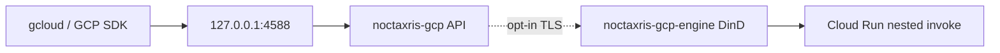

<p align="center">
  
</p>

<p align="center">
  <b>Run GCP-shaped security labs on your laptop without a cloud bill or a host Docker socket.</b>
</p>

```bash
docker pull kyaxris/noctaxris-gcp:latest
# Container bind is 0.0.0.0; generate unique roots (shipped example pair is refused).
ROOT_SA="root@$(openssl rand -hex 4).iam.gserviceaccount.com"
ROOT_TOKEN="$(openssl rand -hex 32)"
docker run -d --name noctaxris-gcp -p 127.0.0.1:4588:4588 \
  -e NOCTAXRIS_GCP_LISTEN=0.0.0.0:4588 \
  -e NOCTAXRIS_GCP_ALLOW_NONLOOPBACK_LISTEN=1 \
  -e NOCTAXRIS_GCP_ROOT_SERVICE_ACCOUNT="$ROOT_SA" \
  -e NOCTAXRIS_GCP_ROOT_ACCESS_TOKEN="$ROOT_TOKEN" \
  kyaxris/noctaxris-gcp:latest
curl http://127.0.0.1:4588/_noctaxris-gcp/health
# ok
```

<p align="center">
  <a href="https://github.com/Kyaxris-Labs/Noctaxris-GCP/actions/workflows/ci.yml"></a>
  <a href="https://hub.docker.com/r/kyaxris/noctaxris-gcp"></a>
  <a href="https://hub.docker.com/r/kyaxris/noctaxris-gcp/tags"></a>
  <a href="LICENSE"></a>
</p>

Point GCP clients at `http://127.0.0.1:4588` with `Authorization: Bearer <token>`.

Go module: [`github.com/Kyaxris-Labs/Noctaxris-GCP`](https://github.com/Kyaxris-Labs/Noctaxris-GCP). Image tags: `latest`, semver releases, and Hub `kyaxris/noctaxris-gcp`.

## Why this exists

| | |
|---|---|
| Lab fidelity | Google IAM allow policies, service accounts, and Bearer auth on a single port |
| Secure defaults | Loopback publish only. No host `docker.sock`. Master key outside the data root |
| REST + gRPC | Cleartext HTTP/2 (h2c) multiplexes both on `:4588` |
| Nested compute | DinD via Compose `noctaxris-gcp-engine` over TLS is opt-in (`compose.engine.yaml`). Default API stays mock-invoke |

## Quick start

Pull the Hub image, run it on loopback `:4588`, then hit CRM with the same root Bearer you passed in.

```bash
docker pull kyaxris/noctaxris-gcp:latest

# Container bind is 0.0.0.0; generate unique roots (shipped example pair is refused).
ROOT_SA="root@$(openssl rand -hex 4).iam.gserviceaccount.com"
ROOT_TOKEN="$(openssl rand -hex 32)"

docker run -d --name noctaxris-gcp -p 127.0.0.1:4588:4588 \
  -e NOCTAXRIS_GCP_LISTEN=0.0.0.0:4588 \
  -e NOCTAXRIS_GCP_ALLOW_NONLOOPBACK_LISTEN=1 \
  -e NOCTAXRIS_GCP_ROOT_SERVICE_ACCOUNT="$ROOT_SA" \
  -e NOCTAXRIS_GCP_ROOT_ACCESS_TOKEN="$ROOT_TOKEN" \
  kyaxris/noctaxris-gcp:latest

curl http://127.0.0.1:4588/_noctaxris-gcp/health
curl http://127.0.0.1:4588/_noctaxris-gcp/ready

curl -H "Authorization: Bearer $ROOT_TOKEN" \
  http://127.0.0.1:4588/v3/projects/noctaxris-gcp-local
```

Nested Cloud Run invoke needs Compose with `noctaxris-gcp-engine`. Copy `docker/.env.example` to `docker/.env`, replace both root values with unique lab credentials, then `docker compose -f docker/compose.yaml --env-file docker/.env up --build`. Default host publish is `127.0.0.1:4588` only. Opt-in nested DinD: add `-f docker/compose.engine.yaml` (see [ops.md](docs/ops.md#compose-overlays-lab-opt-in)). Per-service smoke: [docs/services/](docs/services/index.md).

## Services

| Area | Services |
|------|----------|
| Identity | Cloud Resource Manager, IAM, Service Usage |
| Crypto | Secret Manager, Cloud KMS |
| Data | Cloud Storage, Pub/Sub, Firestore, Datastore, Cloud Bigtable, Spanner, Memorystore Redis, Filestore |
| Audit and observe | Cloud Logging, Cloud Monitoring |
| Compute | Compute Engine (VPC/firewall), Cloud Run, Cloud Functions, Cloud Scheduler, Cloud Tasks, Cloud Build, App Engine |
| Registry | Artifact Registry |
| Networking | Cloud DNS, Cloud Armor, Certificate Manager |
| Analytics and AI | BigQuery, Firebase Auth, Eventarc, Workflows, Dataflow, Vertex AI |

Open the service matrix for detailed actions and gaps. Full notes and CLI smoke: [docs/services/](docs/services/index.md).

<details>
<summary><b>Service matrix</b> (detailed actions / not implemented)</summary>

<table>
  <thead>
    <tr>
      <th>Area</th>
      <th>Services</th>
      <th>Detailed actions</th>
      <th>Not implemented</th>
    </tr>
  </thead>
  <tbody>
    <tr>
      <td rowspan="3" align="center" valign="middle">Identity</td>
      <td>Cloud Resource Manager</td>
      <td>Projects get/list/search/patch + IAM; org seed <code>organizations/noctaxris-gcp-org</code>; folders CRUD lite; TagKeys / TagBindings lite; v1 getAncestry theatre.</td>
      <td>Project create/delete; full hierarchy tooling beyond folders lite.</td>
    </tr>
    <tr>
      <td>IAM</td>
      <td>Service accounts/keys; WIF pool/provider CRUD; STS <code>POST /v1/token</code>; TokenCreator <code>generateAccessToken</code>; allow-policy Evaluate + <code>testIamPermissions</code>.</td>
      <td>Real OIDC IdP verify; custom roles CRUD beyond seeded roles; PKCS#1 signBlob.</td>
    </tr>
    <tr>
      <td>Service Usage</td>
      <td>Enable / disable / list / batchEnable / batchDisable / batchGet / get.</td>
      <td>Async LRO worker (operations complete immediately).</td>
    </tr>
    <tr>
      <td rowspan="2" align="center" valign="middle">Crypto</td>
      <td>Secret Manager</td>
      <td>REST + gRPC secrets/versions; rotation config + lab <code>:rotateSecret</code>; versions sealed with master key.</td>
      <td>CMEK-backed seal via lab KMS; regional secret resources; automatic rotation timers.</td>
    </tr>
    <tr>
      <td>Cloud KMS</td>
      <td>REST v1 key rings/keys; symmetric encrypt/decrypt; RSA_SIGN_PSS sign/verify.</td>
      <td>Asymmetric decrypt depth; import; multi-region keys.</td>
    </tr>
    <tr>
      <td rowspan="8" align="center" valign="middle">Data</td>
      <td>Cloud Storage</td>
      <td>JSON API v1 objects/buckets; bucket IAM; V4 HMAC signed URL; <code>retentionPolicy</code> fail-closed delete/overwrite.</td>
      <td>Object ACLs; soft delete / lifecycle enforce; RSA GOOG4 signed URLs via signBlob.</td>
    </tr>
    <tr>
      <td>Pub/Sub</td>
      <td>gRPC + REST topics/subscriptions/snapshots; dead-letter + exactly-once flag; push <code>oidcToken</code> Bearer JWT; SSRF-gated push.</td>
      <td>Ordering keys; schemas; snapshot backlog retention / seek.</td>
    </tr>
    <tr>
      <td>Firestore</td>
      <td>gRPC Firestore v1; atomic Commit + BatchWrite (<code>FIRESTORE_EMULATOR_HOST</code>).</td>
      <td>Multi-database ids beyond <code>(default)</code>; Listen / realtime.</td>
    </tr>
    <tr>
      <td>Datastore</td>
      <td>gRPC Datastore v1 (<code>DATASTORE_EMULATOR_HOST</code>).</td>
      <td>Full index admin; aggregation queries depth.</td>
    </tr>
    <tr>
      <td>Cloud Bigtable</td>
      <td>REST Admin API v2 + Instance Admin gRPC lite (instances/tables control-plane; Create returns done Operation).</td>
      <td>Row mutate/read; Table Admin gRPC; app profiles; backups.</td>
    </tr>
    <tr>
      <td>Spanner</td>
      <td>REST instances/databases; session commit insert + ExecuteSql/Read rows (SQLite-backed theatre).</td>
      <td>Spanner binary / dialect; update/delete mutations; official gRPC surface.</td>
    </tr>
    <tr>
      <td>Memorystore Redis</td>
      <td>REST v1 location-scoped instances (control-plane theatre).</td>
      <td>Redis process; Cluster / Valkey surfaces.</td>
    </tr>
    <tr>
      <td>Filestore</td>
      <td>REST <code>/file/v1/</code> instances CRUD; create returns completed Operation.</td>
      <td>NFS server; backup/snapshot/restore.</td>
    </tr>
    <tr>
      <td rowspan="2" align="center" valign="middle">Audit and observe</td>
      <td>Cloud Logging</td>
      <td>REST v2 entries, sinks, one-shot tail, copy theatre.</td>
      <td>Live log router depth; BigQuery sink export engine.</td>
    </tr>
    <tr>
      <td>Cloud Monitoring</td>
      <td>REST v3 descriptors, time series, alertPolicies theatre.</td>
      <td>SLO / uptime check engines; notification channel delivery.</td>
    </tr>
    <tr>
      <td rowspan="7" align="center" valign="middle">Compute</td>
      <td>Compute Engine</td>
      <td>Instances (metadata), VPC/firewall CRUD, Images list/get/family stubs, firewall <code>:validate</code>.</td>
      <td>Real VMs/NICs/disks; MIGs; load balancers.</td>
    </tr>
    <tr>
      <td>Cloud Run</td>
      <td>Admin API v2 services/jobs, traffic, IAM, <code>:invoke</code> status/delay; opt-in nested DinD.</td>
      <td>Default nested containers; traffic percent enforce beyond metadata.</td>
    </tr>
    <tr>
      <td>Cloud Functions</td>
      <td>Functions v2, upload URL + source accept, IAM, <code>:invoke</code> stub.</td>
      <td>Real build/runtime; Eventarc wiring from Functions create; 1st gen API.</td>
    </tr>
    <tr>
      <td>Cloud Scheduler</td>
      <td>Jobs, 5-field cron next-run, pause/resume, OIDC audience; SSRF-gated httpTarget.</td>
      <td>Full cron calendar depth; App Engine routing fidelity.</td>
    </tr>
    <tr>
      <td>Cloud Tasks</td>
      <td>Queues/tasks, rate limits, retry, App Engine fields, <code>:run</code>; SSRF-gated httpRequest.</td>
      <td>Lease / pull queue depth; App Engine dispatch binary.</td>
    </tr>
    <tr>
      <td>Cloud Build</td>
      <td>createBuild theatre + triggers CRUD lite; shared regional triggers mux with Eventarc.</td>
      <td>Step execution; image pull/push; SCM checkout.</td>
    </tr>
    <tr>
      <td>App Engine</td>
      <td>Admin API v1 apps/services/versions (control-plane theatre).</td>
      <td>Serving runtime; traffic migrate; flexible env.</td>
    </tr>
    <tr>
      <td rowspan="1" align="center" valign="middle">Registry</td>
      <td>Artifact Registry</td>
      <td>REST v1 repos/packages/versions metadata.</td>
      <td>Blob storage / docker pull plane.</td>
    </tr>
    <tr>
      <td rowspan="3" align="center" valign="middle">Networking</td>
      <td>Cloud DNS</td>
      <td>managedZones + rrsets CRUD; Changes create/get/list theatre.</td>
      <td>Authoritative query plane; DNSSEC.</td>
    </tr>
    <tr>
      <td>Cloud Armor</td>
      <td>securityPolicies CRUD + ByteMatchSet <code>:validate</code>.</td>
      <td>Edge enforce; Adaptive Protection; rate-limit engines.</td>
    </tr>
    <tr>
      <td>Certificate Manager</td>
      <td>certificates + certificateMaps CRUD; create returns completed Operation.</td>
      <td>CA issuance; map entries / GCLB wiring.</td>
    </tr>
    <tr>
      <td rowspan="6" align="center" valign="middle">Analytics and AI</td>
      <td>BigQuery</td>
      <td>datasets/tables, insertAll, tabledata.list, jobs.query (GROUP BY / UNION / INFORMATION_SCHEMA lite).</td>
      <td>Load/extract/copy jobs; partitioned/clustered tables; views/routines.</td>
    </tr>
    <tr>
      <td>Firebase Auth</td>
      <td>Identity Toolkit REST, OOB reset, claims, verifyIdToken.</td>
      <td>Real SMS/email providers; multi-tenancy depth.</td>
    </tr>
    <tr>
      <td>Eventarc</td>
      <td>Triggers/channels; Pub/Sub and GCS delivery + retry; SSRF-gated httpEndpoint.</td>
      <td>Audit / Workflows destinations; dead-letter / ordering.</td>
    </tr>
    <tr>
      <td>Workflows</td>
      <td>Workflows CRUD + executions SUCCEEDED theatre.</td>
      <td>Real workflow engine / connectors.</td>
    </tr>
    <tr>
      <td>Dataflow</td>
      <td>Jobs create/get/list theatre (state advances on get).</td>
      <td>Workers; Flex Templates; streaming runners.</td>
    </tr>
    <tr>
      <td>Vertex AI</td>
      <td>Publisher <code>:predict</code> / <code>:generateContent</code> canned JSON; allowlisted model ids; unknown fail-closed.</td>
      <td>Real models; streaming; endpoint deploy beyond publisher.</td>
    </tr>
  </tbody>
</table>

</details>

## Defaults

| Setting | Value |
|---------|--------|
| Listen | `127.0.0.1:4588` only |
| Docker | No host `docker.sock` (opt-in nested `noctaxris-gcp-engine` for Cloud Run) |
| Nested compute | Off by default (`NOCTAXRIS_GCP_DOCKER_HOST` empty). Live nested invoke needs `compose.engine.yaml` |
| Data ports | Compose publishes only `127.0.0.1:4588` |
| API replicas | **One process per data root.** Multi-replica against the same SQLite volume is unsupported and can corrupt state |
| Credentials | Root SA email + Bearer token via env injection |
| At rest | Master key on sibling secrets volume; sensitive columns sealed |
| Authn | Bearer on API paths except documented public routes (health, ready, version, STS `/v1/token`, Identity Toolkit client methods) |
| HTTP egress | Deny-by-default for push/Scheduler/Tasks/Eventarc; lab catcher + loopback `:4588` only unless allowlisted |

## Architecture

Loopback API only. Nested DinD over TLS is opt-in. No host `docker.sock`.



Full graph and request path: [docs/architecture.md](docs/architecture.md).

## Docs

| | |
|---|---|
| [docs/index.md](docs/index.md) | Architecture, configuration, ops, security posture |
| [docs/services/](docs/services/index.md) | Per-service APIs, authz notes, CLI smoke |
| [docs/ops.md](docs/ops.md) | Backup, restore, upgrade, graceful shutdown, CI matrix |
| [docs/release.md](docs/release.md) | Cutting a release (`v0.5.0`, Hub `latest` / semver) |
| [tests/README.md](tests/README.md) | SDK and Terraform suites (Compose required for live runs) |

## Contributors

[](https://github.com/Kyaxris-Labs/Noctaxris-GCP/graphs/contributors)

## License

[MIT](LICENSE)
