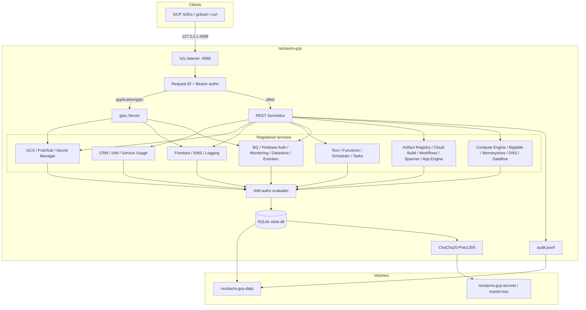

# Architecture

Noctaxris-GCP is a single Go process that multiplexes Google-shaped REST and gRPC
on one loopback port.

## Kernel packages

| Package | Role |
|---------|------|
| `internal/config` | `NOCTAXRIS_GCP_*` load + loopback / TLS gate |
| `internal/kernel/authn` | Bearer extraction; root vs registered tokens |
| `internal/kernel/authz` | IAM policy Evaluate / testIamPermissions |
| `internal/kernel/audit` | JSONL audit writer |
| `internal/store` | SQLite schema, Seal/Unseal, EnsureRoot |
| `internal/gcperrors` | Google REST JSON errors + gRPC status helpers |
| `internal/server` | h2c routing, health, middleware, service registration |

## Service registration

`server.New` wires registration helpers after health routes, in this order:

| Helper | Surface |
|--------|---------|
| `registerIdentity` | Cloud Resource Manager (projects, org seed, folders), IAM Admin, Service Usage (REST); creates gRPC server + Bearer interceptors |
| `registerData` | Cloud Storage (REST), Pub/Sub (gRPC + REST), Secret Manager (REST + gRPC) |
| `registerDocsCrypto` | Firestore (gRPC), Cloud KMS (REST), Cloud Logging (REST) |
| `registerServerless` | Cloud Run, Cloud Functions, Cloud Scheduler, Cloud Tasks (REST) |
| `registerAnalytics` | BigQuery (REST), Firebase Auth / Identity Toolkit (REST), Cloud Monitoring (REST), Datastore (gRPC), Eventarc (REST) |
| `registerAppsBuild` | Artifact Registry, Cloud Build, Workflows, Cloud Spanner, App Engine (REST) |
| `registerComputeData` | Compute Engine (incl. VPC/firewall), Bigtable Admin, Memorystore Redis, Cloud DNS, Dataflow (REST) |

## Request path

1. Assign `X-Request-Id` when missing.
2. Skip auth for health / ready / version.
3. For REST: require Bearer; attach principal to context.
4. For gRPC: Bearer interceptor attaches principal; handlers re-check IAM.
5. Handlers call authz with `(principal, permission, resource)`.
6. Persist through the store; seal sensitive columns with the master key.
